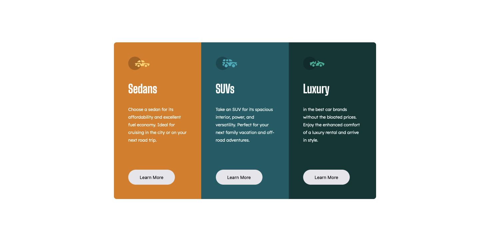

<h1 align="center">3-column preview card component</h1>

 <a align="center" href="https://github.com/CtrlAltSudo/3-column-preview-card-component">Live Demo</a>

 <a align="center" href="https://www.frontendmentor.io/solutions/product-preview-card-component-I2MQmRTOpy">Solution Page</a>

<h2 align="center">Project Screenshot<h2>

  </img>

## Description

This is a 3-column preview card component challenge by Frontend Mentor, Frontend Mentor is a website that provides various web development challenges to help you develop your coding skills.

## Built with 

HTML

CSS

Flexbox

## What I learnt 
This is the first time I've used ":nth-of-type() pseudo class.

## Authors

<a href="https://github.com/CtrlAltSudo">CtrlAltSudo</a>.

